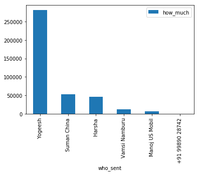
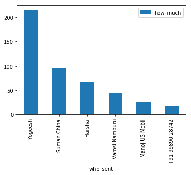
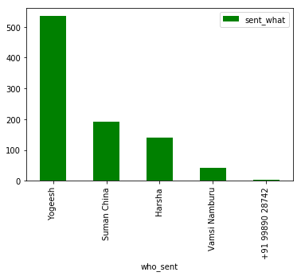
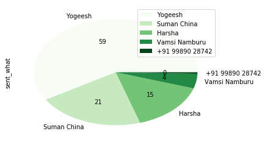
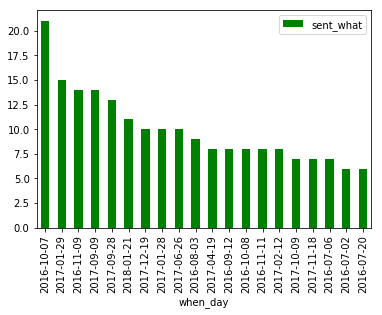
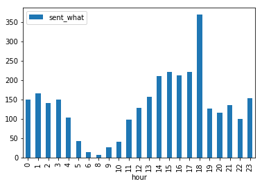

# This Notebook illustrates how to analyse a Whatsapp group conversation and analyse sentiment

__How do we do this__
1. Retrieve conversation from a Whatsapp Group Chat as text file
2. Interpret structure of the conversations and build regular expressions to break down in to tokens
3. Parse content and build a Pandas dataframe to analyse
4. Invoke Google Natural Language API to analyse sentiments

__What Python features are used__
This notebook explores the following features of Python
+ Regular Expressions
+ Pandas Data Frames
+ Google Natural Language API

## 1. Retrieve a conversation from Whatsapp

+ Open a Whatsapp conversation
+ Open Menu (Top Right)
+ Expand More
+ Export Chat
+ Multiple options are available. Choose E-Mail to get the conversation extract as a mail attachment
+ Store in a local file as txt

## 2. Interpret converstation structure

A typical message could be as follows. The structure can vary based on phone settings

5/4/16, 4:44 PM - Vamsi Namburu: Good Morning

The string can be broken down in to **date**, **time**, **who** sent the message and **the** message
<chat_date>,<chat_time> - <chat_who>: <chat_what>

## 3.1 Parse Content

Create a Python Regular Expression to extract based on the pattern and delimiters

#### 3.1.1 Regular Expression for each message


```python
import re
pattern_extract_all = re.compile(r'(?P<chat_date>\d{1,2}\/\d{1,2}\/\d{2,4}),\s(?P<chat_time>\d{1,2}:\d{1,2}\s[A|P]M)\s-\s(?P<chat_who>[^:]+):(?P<chat_what>.*)')
```

#### 3.1.2 Helper expression to check if the message starts with a date to distinguish between a new message and new line within a message


```python
pattern_sw_date = re.compile(r'^(?P<chat_date>\d{1,2}\/\d{1,2}\/\d{2,4})')
```


```python
# Import other standard libraries
import string
from datetime import datetime
```


```python
#Open whatsapp conversation export
fhand = open('WHATSAPP_ANALYSIS.txt','r')
```


```python
# Some variables to parse the whatsapp text
prev_mesg = ''
mesg_list = list()  # A List to hold each message
media_mesg = 'N'
```

#### 3.1.3 Loop through the lines,  gather tokens from the messages, build a message list


```python
for line in fhand:
    if len(line.rstrip()) < 1 : continue  #Ignore empty lines
    #print len(line)    
    first_line_of_mesg = pattern_sw_date.search(line.rstrip())
    if first_line_of_mesg:
        if len(prev_mesg) > 0 :
            mesg_list.append((chat_date,chat_time,chat_who,prev_mesg,len(prev_mesg),media_mesg)) # Message is a tuple of all tokens
        prev_mesg = ''
        media_mesg ='N'
        read_all_patterns = pattern_extract_all.search(line.rstrip())
        if read_all_patterns:
            chat_date = read_all_patterns.group('chat_date')
            chat_time = read_all_patterns.group('chat_time')
            chat_who = read_all_patterns.group('chat_who')
            chat_what = read_all_patterns.group('chat_what')
            if chat_what.find('<Media omitted>') != -1 : media_mesg = 'Y'
            prev_mesg = chat_what
            #print chat_date,chat_time,chat_who,chat_what
    else:
        # Simply accumulate the line
        prev_mesg = prev_mesg+line
fhand.close()
```

#### 3.1.4 Examine a sample message


```python
mesg_list[12]
```


    ('5/4/16',
     '4:44 PM',
     'Vamsi Namburu',
     ' I am also stuck and busy here.',
     31,
     'N')


### 3.2 Convert the list of tuples in to a dictionary with headers to convert into a DataFrame

Import few data science libraries


```python
# Data Science Libraries for data analysis and plotting
import pandas as pd
import numpy as np
from matplotlib import pyplot as plt
from matplotlib import cm
%matplotlib notebook

```

#### 3.2.1 A function to convert a list to a dictionary


```python

def convert_to_dict_list(mesg_list):
    refined_mesg_list = []
    for idx in range(len(mesg_list)):
        d = { 'when_day' : datetime.date(datetime.strptime(mesg_list[idx][0],'%m/%d/%y')), \
              'when_time': datetime.time(datetime.strptime(mesg_list[idx][1],'%I:%M %p')), \
              'who_sent' : mesg_list[idx][2], \
              'sent_what' : mesg_list[idx][3],\
              'how_much' : mesg_list[idx][4], \
              'sent_media' : mesg_list[idx][5]
            }
        refined_mesg_list.append(d)
    return refined_mesg_list
```


```python
dct = convert_to_dict_list(mesg_list)
```

#### 3.2.2 Convert the dictionary into a pandas DataFrame


```python
def convert_to_DF(mesg_dict):
    df = pd.DataFrame(mesg_dict)
    return df
```


```python
df = convert_to_DF(dct)
```

#### 3.2.3 Analyse the DataFrame


```python
df_counts = df.groupby('who_sent').agg({'sent_what':'count'})
```


```python
#messages by each group member
df_counts
```


<div>

<table border="1" class="dataframe">
  <thead>
    <tr style="text-align: right;">
      <th></th>
      <th>sent_what</th>
    </tr>
    <tr>
      <th>who_sent</th>
      <th></th>
    </tr>
  </thead>
  <tbody>
    <tr>
      <th>Harsha</th>
      <td>674</td>
    </tr>
    <tr>
      <th>Manoj US Mobil</th>
      <td>265</td>
    </tr>
    <tr>
      <th>Suman China</th>
      <td>554</td>
    </tr>
    <tr>
      <th>Vamsi Namburu</th>
      <td>289</td>
    </tr>
    <tr>
      <th>Yogeesh</th>
      <td>1309</td>
    </tr>
    <tr>
      <th>‪+91 99890 28742‬</th>
      <td>7</td>
    </tr>
  </tbody>
</table>
</div>


#### 3.2.4 Histogram plot of message count by each group member


```python
df_counts.sort_values(by='sent_what',ascending=False).plot(kind='bar')
```


    <matplotlib.axes._subplots.AxesSubplot at 0x7f6c16d77150>


#### 3.2.5 Cumulative sum of message length sent by each member


```python
df_mesgs = df.groupby('who_sent').agg({'how_much':'sum'})
df_mesgs
```


<div>

<table border="1" class="dataframe">
  <thead>
    <tr style="text-align: right;">
      <th></th>
      <th>how_much</th>
    </tr>
    <tr>
      <th>who_sent</th>
      <th></th>
    </tr>
  </thead>
  <tbody>
    <tr>
      <th>Harsha</th>
      <td>45845</td>
    </tr>
    <tr>
      <th>Manoj US Mobil</th>
      <td>6934</td>
    </tr>
    <tr>
      <th>Suman China</th>
      <td>52879</td>
    </tr>
    <tr>
      <th>Vamsi Namburu</th>
      <td>12573</td>
    </tr>
    <tr>
      <th>Yogeesh</th>
      <td>280676</td>
    </tr>
    <tr>
      <th>‪+91 99890 28742‬</th>
      <td>118</td>
    </tr>
  </tbody>
</table>
</div>


```python
df_mesgs.sort_values(by='how_much',ascending=False).plot(kind='bar')
```


    <matplotlib.axes._subplots.AxesSubplot at 0x7f6c16a08f10>





#### 3.2.6 Average Message Size


```python
df_avg_mesg = df.groupby('who_sent').agg({'how_much':'mean'})
df_avg_mesg
```


<div>

<table border="1" class="dataframe">
  <thead>
    <tr style="text-align: right;">
      <th></th>
      <th>how_much</th>
    </tr>
    <tr>
      <th>who_sent</th>
      <th></th>
    </tr>
  </thead>
  <tbody>
    <tr>
      <th>Harsha</th>
      <td>68.019288</td>
    </tr>
    <tr>
      <th>Manoj US Mobil</th>
      <td>26.166038</td>
    </tr>
    <tr>
      <th>Suman China</th>
      <td>95.449458</td>
    </tr>
    <tr>
      <th>Vamsi Namburu</th>
      <td>43.505190</td>
    </tr>
    <tr>
      <th>Yogeesh</th>
      <td>214.420168</td>
    </tr>
    <tr>
      <th>‪+91 99890 28742‬</th>
      <td>16.857143</td>
    </tr>
  </tbody>
</table>
</div>


```python
df_avg_mesg.sort_values(by='how_much',ascending=False).plot(kind='bar')

```


    <matplotlib.axes._subplots.AxesSubplot at 0x7f6c16980b50>





#### 3.2.7 Who shared maximum media


```python
# Pass a boolean series to create another dataframe
media_mask = df['sent_media'] == 'Y'
df_media = df[media_mask].groupby('who_sent').agg({'sent_what':'count'}).sort_values(by='sent_what',ascending=False)
df_media
```


<div>

<table border="1" class="dataframe">
  <thead>
    <tr style="text-align: right;">
      <th></th>
      <th>sent_what</th>
    </tr>
    <tr>
      <th>who_sent</th>
      <th></th>
    </tr>
  </thead>
  <tbody>
    <tr>
      <th>Yogeesh</th>
      <td>535</td>
    </tr>
    <tr>
      <th>Suman China</th>
      <td>193</td>
    </tr>
    <tr>
      <th>Harsha</th>
      <td>139</td>
    </tr>
    <tr>
      <th>Vamsi Namburu</th>
      <td>41</td>
    </tr>
    <tr>
      <th>‪+91 99890 28742‬</th>
      <td>4</td>
    </tr>
  </tbody>
</table>
</div>


```python
df_media.idxmax()['sent_what'] + " sent maxiumum number of messages : "+ str(df_media.max()['sent_what'])
```


    'Yogeesh sent maxiumum number of messages : 535'


```python
df_media.plot(kind='bar',colormap='ocean')
```


    <matplotlib.axes._subplots.AxesSubplot at 0x7f6c169ed350>





```python
df_media.plot(subplots=True,kind='pie',autopct='%.0f',colormap='Greens')
```


    array([<matplotlib.axes._subplots.AxesSubplot object at 0x7f6c16875550>],
          dtype=object)





#### 3.2.8 Who has sent the largest message and when


```python
d = df.max()
print "On "+str(d['when_day'])+" at "+str(d['when_time'])+' '+d['who_sent']+' sent the largest message which is '+str(d['how_much'])
```

    On 2018-02-15 at 23:59:00 ‪+91 99890 28742‬ sent the largest message which is 11377


#### 3.2.9 The day when the most number of messages were sent


```python
d = df.groupby('when_day').agg({'sent_what':'count'})
x = "On "+str(d.idxmax()['sent_what'])+' a maximum of '+str(d.max()['sent_what'])+" messages were exchanged in the group"
x
```


    'On 2016-12-25 a maximum of 128 messages were exchanged in the group'


#### 3.2.10 When were most number of media shared


```python
media_mask = df['sent_media'] == 'Y'
df_media = df[media_mask].groupby('when_day').agg({'sent_what':'count'}).sort_values(by='sent_what',ascending=False).head(20)
df_media.plot(kind='bar',colormap='ocean')
```


    <matplotlib.axes._subplots.AxesSubplot at 0x7f6c16829690>





#### 3.2.11 Busiest Hour for the group


```python
df['hour'] = df['when_time'].apply(lambda x : x.hour)
df.groupby('hour').agg({"sent_what":"count"}).plot(kind='bar')
```


    <matplotlib.axes._subplots.AxesSubplot at 0x7f6c1691f150>





##### Majority of the messages are sent at 18:00 roughly the logff time

### 4 Sentiment Analysis using Google Natural Language API

#### 4.1.1 Google API Setup

+ If using pip, install google-cloud-language 
+ If using Anaconda, install google-cloud-sdk & bioconda

#### 4.1.2 Setup of API Key and OS Parameter

+ Download API Key Json from Google account
+ Setup GOOGLE_LANGUAGE_CREDENTIALS environment variable to point to the json file
[Detailed instructions available here](https://cloud.google.com/natural-language/docs/reference/libraries#client-libraries-install-python)


```python
# Google Natural Language API to analyse sentiments
from google.cloud import language
from google.cloud.language import enums
from google.cloud.language import types
```


```python
client = language.LanguageServiceClient()
```

#### 4.2.1 Create a function to get sentiment for a text


```python
def get_sentiment(mesg):
    try:
        
        document = types.Document(content=mesg,type=enums.Document.Type.PLAIN_TEXT)
        sentiment = client.analyze_sentiment(document=document).document_sentiment
        return round(sentiment.score,2)
    except:
        return 0
#exception used to avoid messages failing due to non-english messages and non-standard text
```

#### 4.2.2 Test a sample set of messages


```python
get_sentiment('I am very disappointed')
```


    -0.9


```python
get_sentiment('Happiest moment of my life')
```


    0.9


#### 4.3.1 Analyse sentiment for the month of Dec-2016


```python
dt_dec_1_2016  = datetime.date(datetime(2016,12,1))
dt_dec_31_2016 = datetime.date(datetime(2016,12,31))
dec_mask = (df['when_day'] >= dt_dec_1_2016) & (df['when_day'] <= dt_dec_31_2016)
d = df[dec_mask]
d['sentiment'] = d['sent_what'].map(lambda x : get_sentiment(x))
```

#### 4.3.2 Messages with Positive Sentiment


```python
d[d['sentiment'] > 0.5 ][6:10]
```


<div>

<table border="1" class="dataframe">
  <thead>
    <tr style="text-align: right;">
      <th></th>
      <th>how_much</th>
      <th>sent_media</th>
      <th>sent_what</th>
      <th>when_day</th>
      <th>when_time</th>
      <th>who_sent</th>
      <th>hour</th>
      <th>sentiment</th>
    </tr>
  </thead>
  <tbody>
    <tr>
      <th>1160</th>
      <td>8</td>
      <td>N</td>
      <td>Is good</td>
      <td>2016-12-25</td>
      <td>18:01:00</td>
      <td>Suman China</td>
      <td>18</td>
      <td>0.7</td>
    </tr>
    <tr>
      <th>1172</th>
      <td>25</td>
      <td>N</td>
      <td>Dhruva is also very good</td>
      <td>2016-12-25</td>
      <td>18:04:00</td>
      <td>Yogeesh</td>
      <td>18</td>
      <td>0.8</td>
    </tr>
    <tr>
      <th>1188</th>
      <td>23</td>
      <td>N</td>
      <td>Happy Christmas to all</td>
      <td>2016-12-25</td>
      <td>18:09:00</td>
      <td>Suman China</td>
      <td>18</td>
      <td>0.8</td>
    </tr>
    <tr>
      <th>1194</th>
      <td>12</td>
      <td>N</td>
      <td>Enjoy Suman</td>
      <td>2016-12-25</td>
      <td>18:10:00</td>
      <td>Harsha</td>
      <td>18</td>
      <td>0.8</td>
    </tr>
  </tbody>
</table>
</div>


#### 4.3.3 Messages with Negative Sentiment


```python
d[d['sentiment'] < -0.2 ][6:8]
```


<div>

<table border="1" class="dataframe">
  <thead>
    <tr style="text-align: right;">
      <th></th>
      <th>how_much</th>
      <th>sent_media</th>
      <th>sent_what</th>
      <th>when_day</th>
      <th>when_time</th>
      <th>who_sent</th>
      <th>hour</th>
      <th>sentiment</th>
    </tr>
  </thead>
  <tbody>
    <tr>
      <th>1217</th>
      <td>22</td>
      <td>N</td>
      <td>Yes, song is very bad</td>
      <td>2016-12-25</td>
      <td>18:15:00</td>
      <td>Suman China</td>
      <td>18</td>
      <td>-0.7</td>
    </tr>
    <tr>
      <th>1218</th>
      <td>16</td>
      <td>N</td>
      <td>No one can humm</td>
      <td>2016-12-25</td>
      <td>18:15:00</td>
      <td>Suman China</td>
      <td>18</td>
      <td>-0.4</td>
    </tr>
  </tbody>
</table>
</div>


